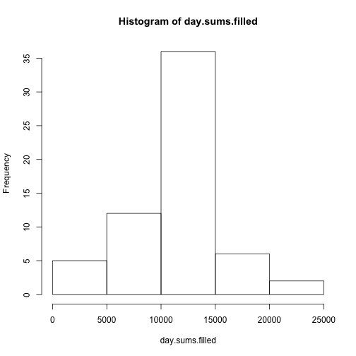

### Loading and preprocessing data

```r
if (!exists("mydata")) {
  mydata <- read.csv("activity.csv")
	mydata$date <- as.Date(mydata$date, format = "%Y-%m-%d")
	mydata$interval <- factor(mydata$interval)
}
```


### What is mean total number of steps taken per day?

***"Make a histogram of the total number of steps taken each day"***

```r
day.sums <- tapply(mydata$steps, mydata$date, sum)
hist(day.sums)
```

 

***"Calculate and report the mean and median of the total number of steps taken per day"***

```r
steps.mean <- mean(day.sums, na.rm=TRUE)
steps.mean
```

```
## [1] 10766.19
```

```r
steps.median <- median(day.sums, na.rm=TRUE)
steps.median
```

```
## [1] 10765
```


### What is the average daily activity pattern?

***"Make a time series plot (i.e. type = "l") of the 5-minute interval (x-axis) and the average number of steps taken, averaged across all days (y-axis)"***


```r
# get average number of steps for all time intervals
interval.means <- tapply(mydata$steps, mydata$interval, mean, na.rm=TRUE)

# get list of intervals
intervals <- levels(mydata$interval)

plot(intervals, interval.means, type="l")
```

 

***"Which 5-minute interval, on average across all the days in the dataset, contains the maximum number of steps?"***


```r
# get index for maximum number of steps
max.index <- which.max(interval.means)

highest.interval <- levels(mydata$interval)[max.index]
highest.interval
```

```
## [1] "835"
```


### Imputing missing values

***"Calculate and report the total number of missing values in the dataset (i.e. the total number of rows with NAs)"***


```r
num.missing <- sum(is.na(mydata$steps))
num.missing
```

```
## [1] 2304
```

***"Create a new dataset that is equal to the original dataset but with the missing data filled in."***

I chose to fill in the missing values with the average of the time interval.  First, create a lookup table with the intervals and their means.


```r
interval.table <- data.frame(interval=intervals, means=interval.means)
```

Next, create a copy of the data with NAs filled in from the lookup table

```r
mydata.filled <- mydata
for (i in seq_along(mydata.filled$steps)) {
  if (is.na(mydata.filled$steps[i])) {
		mydata.filled$steps[i] <- 
			interval.table$means[intervals==mydata.filled$interval[i]]
	}
}
```

***"Make a histogram of the total number of steps taken each day"***

```r
day.sums.filled <- tapply(mydata.filled$steps, mydata.filled$date, sum)
hist(day.sums.filled)
```

 


***"Calculate and report the mean and median total number of steps taken per day."***

```r
steps.mean.filled <- mean(day.sums.filled)
steps.mean.filled
```

```
## [1] 10766.19
```

```r
steps.median.filled <- median(day.sums.filled)
steps.median.filled
```

```
## [1] 10766.19
```


### Are there differences in activity patterns between weekdays and weekends?

***"Create a new factor variable in the dataset with two levels – “weekday” and “weekend” indicating whether a given date is a weekday or weekend day."***


```r
w <- weekdays(mydata$date) %in% c("Saturday", "Sunday")
w <- factor(w)
levels(w) <- c("weekday", "weekend")
mydata.filled$weekday <- w
```


#### PLOT FOR WEEKEND NOT FINISHED FOR ASSIGNMENT!!!!!


